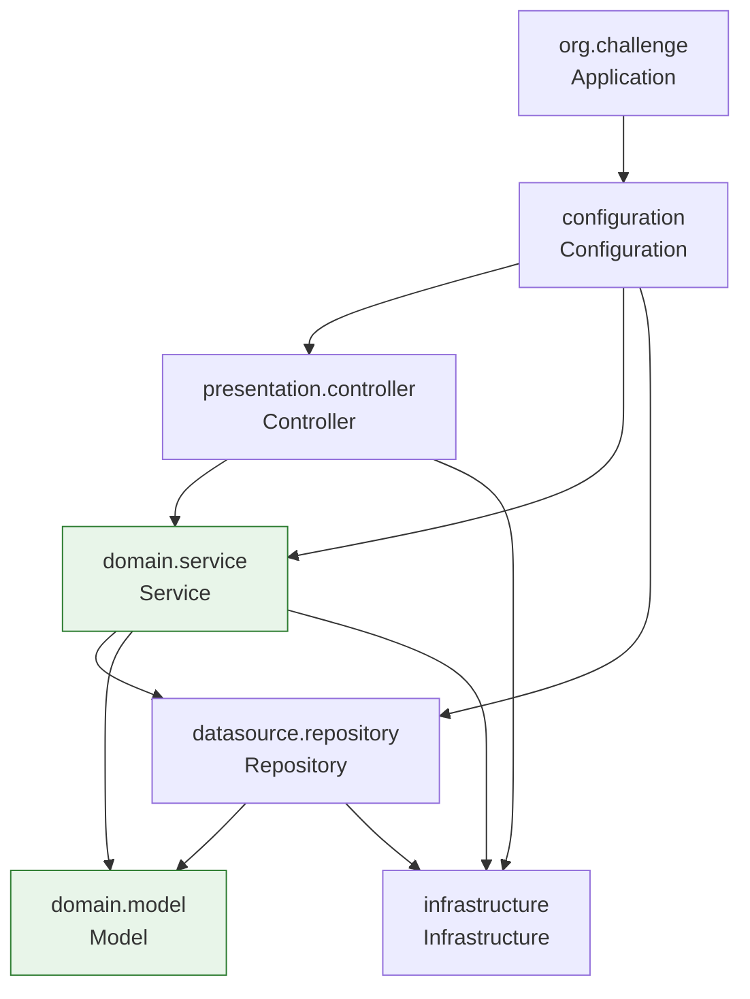

# vuln-severity-evaluator — Documentación

Servicio backend en **Java / Spring Boot** para evaluar la **severidad de
vulnerabilidades**, con **Spring AI** (OpenAI) como motor de razonamiento asistido.

Este repositorio es **greenfield**: por ahora solo existen las convenciones de
capas y los guardrails de mantenibilidad (tests de fitness), sin Services ni
endpoints implementados todavía. Esta documentación describe ese esqueleto y
debe crecer junto con el primer subdominio real que se implemente.

---

## Stack Tecnológico

| Componente | Tecnología | Versión |
|-----------|-----------|---------|
| Lenguaje | Java | — |
| Build | Gradle (wrapper) | — |
| Framework | Spring Boot | **4.1.1** |
| Web | `spring-boot-starter-webmvc` | (gestionado por Spring Boot) |
| Persistencia | `spring-boot-starter-data-jpa` | (gestionado por Spring Boot) |
| IA / razonamiento | Spring AI · `spring-ai-starter-model-openai` | **2.0.1** (BOM) |
| Arquitectura (fitness tests) | ArchUnit | 1.5.0 |
| Complejidad (fitness tests) | JavaParser | 3.23.1 |
| Tests | JUnit | 6.0.0 |

---

## Cómo está esquematizada la app

El árbol de capas está **definido y enforced por `ArchitectureTest`**
(`src/test/java/org/challenge/vulnseverityevaluator/ArchitectureTest.java`),
aunque todavía no hay clases reales ocupando la mayoría de esas capas.



- **Application** (`org.challenge`) — paquete raíz; punto de ensamblaje/arranque.
- **Configuration** (`..configuration..`) — beans `@Configuration`; capa de wiring, no puede ser accedida por ninguna otra capa.
- **Controller** (`..presentation.controller..`) — endpoints HTTP (`@Controller`), solo puede ser accedida por `Configuration`.
- **Service** (`..domain.service..`) — lógica de negocio (`@Service`).
- **Model** (`..domain.model..`) — entidades (`@Entity`), sin dependencias hacia el resto del dominio.
- **Repository** (`..datasource.repository..`) — acceso a datos (`@Repository`).
- **Infrastructure** (`..infrastructure..`) — helpers transversales.

Detalle completo, matriz de dependencias y reglas de anotación en
[Arquitectura](/architecture/) y el [Modelo de capas](/architecture/layering-model).

---

## Navegación

| Sección | Descripción |
|---------|-------------|
| [Arquitectura](/architecture/) | Esquema de la app, capas y constraints de mantenibilidad |
| [Modelo de capas](/architecture/layering-model) | Cómo funciona el sistema de capas y por qué |
| [ADRs](/adr/) | Decisiones arquitectónicas tomadas |
| [RFCs](/rfcs/) | Propuestas en debate |
| [Dominio](/domain/) | Contexto de negocio de evaluación de severidad de vulnerabilidades |
| [Glosario](/domain/glossary) | Términos del dominio y de la arquitectura |
| [Runbooks](/runbooks/) | Procedimientos operacionales |
| [Postmortems](/postmortems/) | Incidentes y lecciones aprendidas |
| [Cómo usar esta doc](/_meta/how-to-use) | Tabla de decisión + sync checklist |

---

## Convenciones para IA y humanos

Las reglas de arquitectura, nomenclatura de tests y complejidad son de
cumplimiento **obligatorio** y están enforced por los tests de fitness en
`src/test/java/org/challenge/vulnseverityevaluator/`
(`ArchitectureTest.java`, `MethodComplexityTest.java`). Todavía no existen
`AGENTS.md` / `CLAUDE.md` en este repo — si se agregan, deben referenciar estos
mismos tests como fuente de verdad en lugar de duplicar las reglas en prosa.

```bash
./gradlew build
./gradlew test
```

---

> Esta documentación se mantiene viva. Si algo está desactualizado, actualizarlo
> es parte del ciclo de desarrollo. Ver [cómo usar esta documentación](/_meta/how-to-use).
