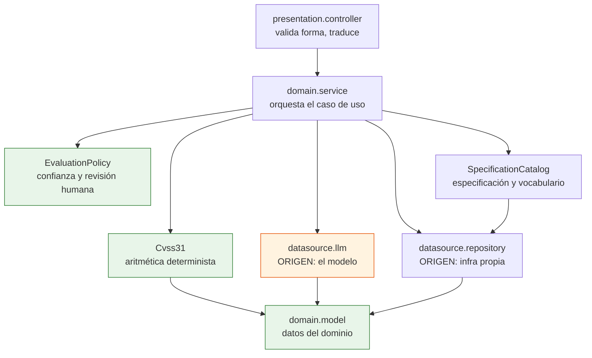
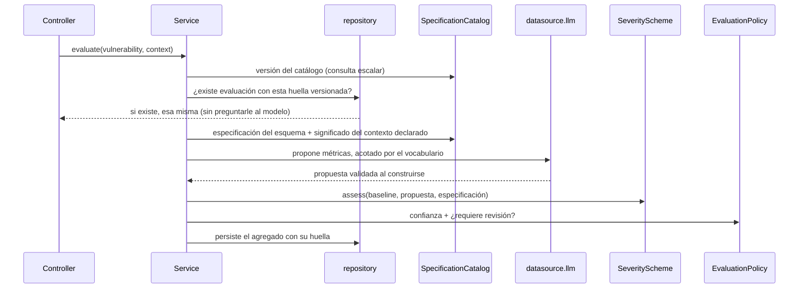

# Architecture Design Document

> Punto de entrada del proyecto. Describe **la solución**: por qué existe, qué la restringe, cómo está armada y
> dónde están sus límites. La estructura viva del código está en [Arquitectura](/architecture/); el *por qué* de cada
> decisión puntual, en los [ADRs](/adr/). Este documento no duplica ninguno: los conecta.

---

## 1. Contexto y problema

Una organización que consume dependencias open source a gran escala recibe muchos más hallazgos de vulnerabilidades
de los que puede atender. El insumo habitual para priorizar es el **CVSS Base Score**, que tiene una limitación de
diseño: describe la vulnerabilidad **en abstracto**, no el riesgo que representa en una aplicación concreta.

El resultado es conocido: un CVE 9.8 en una librería que solo usa un batch aislado compite por atención con el mismo
9.8 en un servicio expuesto a internet que maneja datos personales. Priorizar por Base Score trata a los dos igual, y
el equipo de seguridad termina contextualizando a mano.

Este servicio hace ese trabajo de forma asistida: dada la descripción de una vulnerabilidad y el contexto tecnológico
de una aplicación, produce una **severidad contextualizada, justificada y auditable**.

Demostración concreta, con el mismo CVE-2021-44228 y el mismo vector base:

| Aplicación | Contexto declarado | Baseline | Contextual |
|---|---|---|---|
| `checkout-api` | internet-facing, PII, Tier 1 | 10.0 CRITICAL | **10.0 CRITICAL** |
| `batch-reporter` | aislada, datos públicos, Tier 3 | 10.0 CRITICAL | **7.6 HIGH** (delta −2.4) |

---

## 2. Drivers y atributos de calidad

| Driver | Qué significa acá |
|---|---|
| **Precisión contextualizada** | La salida tiene que diferenciarse del Base Score. Si el score contextual siempre coincide con el base, el servicio no aporta nada |
| **Auditabilidad** | Toda evaluación se persiste con su justificación y su procedencia. Un score asistido por IA que no se puede revisar después no es aceptable |
| **Determinismo del servicio** | El modelo no es determinista; el servicio sí debe serlo. Ver §7 |
| **Honestidad sobre la confianza** | La respuesta tiene que decir cuándo *no* confiar en ella |
| **Costo acotado** | La llamada al modelo es el recurso caro y limitado |
| **Mantenibilidad** | El esquema de scoring, el proveedor de modelo y la fuente de contexto cambian en el tiempo. Ninguno debe arrastrar al resto |
| **Seguridad** | La entrada es texto no confiable escrito por terceros. Se la trata como dato en todo el recorrido |

---

## 3. Restricciones y supuestos

- **No hay inventario de aplicaciones disponible.** El contexto lo declara el caller
  ([ADR-0003](/adr/0003-caller-declared-application-context)).
- **La aplicación no corre sobre la plataforma interna.** Por eso no hay `/ping`, ni Access Groups, ni SDK de
  autorización: el camino correcto queda documentado pero no se inventa un reemplazo casero (§8).
- **Tiene que ser reproducible sin credenciales.** El perfil `local` usa un modelo determinista, así que el flujo
  completo corre sin API key y sin red.
- **Prueba de concepto.** La base es H2 en memoria, compartida por los perfiles `local`, `production-openai` y
  `production-grok`; los dos últimos usan la misma implementación externa configurada por proveedor. El contrato HTTP no está
  versionado en el path. La arquitectura obtiene determinismo por la evaluación persistida y su huella, pero H2
  efímera solo lo conserva mientras el proceso está levantado; una base durable y migraciones son necesarias para
  mantenerlo tras reinicios.

---

## 4. Alcance

**Incluido:** un endpoint que evalúa una vulnerabilidad contra una aplicación y persiste el resultado; recuperación
por identificador; CVSS v3.1 Base + Environmental detrás de una interfaz, con su especificación como dato en base;
catálogo de contexto en base; datasource de modelo con implementación real (Spring AI / OpenAI) y determinista;
validación en el borde; errores RFC 7807; guardrails extendidos.

**Explícitamente afuera:** evaluación por lote y camino asíncrono; consulta a feeds externos de advisories para
anclar el baseline; resolución del contexto contra un inventario real; autenticación y autorización propias;
migraciones versionadas de base de datos.

---

## 5. Vista de solución

El estilo de capas lo define el repositorio ([Modelo de capas](/architecture/layering-model)). Lo propio de esta
solución es **cómo se reparten los orígenes de datos** y **dónde vive cada responsabilidad**.

**Dos familias de datasource, no una.** `datasource/repository` es información de la que la aplicación es fuente
directa: su propia infraestructura. `datasource/llm` es un origen distinto — un modelo al que se le pide una opinión.
Separarlas hace visible que una es confiable por construcción y la otra no, y el guardrail trata a cada una como una
capa propia con sus propias reglas de acceso.

**`Cvss31` no toca datasource.** Recibe la especificación como argumento, así que es una función pura de sus
entradas: testeable sin base y sin posibilidad de alcanzar un origen de datos por accidente.

### Flujo de una evaluación

---

## 6. Modelo de dominio

El agregado es `VulnerabilityEvaluation`: registra qué se preguntó, qué propuso el modelo, qué calculó el esquema y
bajo qué condiciones. Es **el único objeto que devuelve el service**, y es completo a propósito, así `presentation`
tiene todo lo que necesita sin que el service cruce la frontera de capas.

`domain/model` contiene solo datos: entidades, embeddables, value objects y enums. El comportamiento vive en
`domain/service` — el esquema de scoring, la política de confianza, el catálogo, el caso de uso. La única lógica que
queda en el modelo es la validación de `ModelSeverityProposal`, y está ahí porque ese value object **es** la
traducción de la respuesta de un origen de datos: su razón de existir es no poder construirse en estado inválido.

Los bordes HTTP **reutilizan** esos tipos en vez de espejarlos. `Vulnerability` y `ApplicationContext` llevan sus
propias constraints; la respuesta carga `SeverityScore`, `MetricChoice` y `Provenance` tal cual. Solo se abstrae el
agrupamiento, que es lo único genuinamente de presentación.

Detalle en [Modelo de datos](/architecture/data-model) y [Dominio](/domain/).

---

## 7. Uso de IA, determinismo y límites

La decisión central:

> **El LLM nunca devuelve un número. Devuelve elecciones de métricas de un vocabulario cerrado, más su rationale.
> La aritmética la hace el dominio.**

**Sobre determinismo, que es el punto más fino del diseño.** Un LLM no es una fuente determinista, y
`temperature: 0.0` no lo convierte en una: ningún proveedor garantiza salidas idénticas. La aplicación, en cambio, sí
debe ser una fuente determinista. Se resuelve en cuatro pasos: acotar la variación a un conjunto finito de valores
admitidos; computar todos los números acá; registrar la elección con su procedencia; y **responder una request
idéntica con la evaluación ya registrada** en lugar de volver a preguntar. Ese último paso es un lookup por huella en
la tabla de evaluaciones — no un caché, que expiraba y se perdía al reiniciar. La garantía se completa con una base
durable: la H2 en memoria de esta prueba de concepto valida el lookup, pero pierde las filas al reiniciar.

Tratamiento completo —alucinación, drift, inyección de prompt, y por qué la salida nunca dispara remediación
automática— en [Uso de IA y sus límites](/architecture/ai-usage-and-limits) y
[ADR-0002](/adr/0002-language-model-as-datasource).

---

## 8. Seguridad

| Amenaza | Control |
|---|---|
| Entrada no confiable (CWE-20) | Bean Validation en los propios tipos de dominio; el contexto se valida contra el catálogo; tope de 8000 caracteres en la descripción |
| Inyección de prompt (OWASP LLM01) | La descripción viaja como **parámetro** de plantilla, nunca como parte de la instrucción; bloque delimitado y declarado como dato; sin tool-calling; salida restringida al vocabulario; el baseline del caller no es modificable por el modelo |
| Salida del modelo no confiable | `ModelSeverityProposal` se valida al construirse: rechazo explícito, nunca coerción. Contador de rechazos para detectar drift |
| Contexto auto-declarado (CWE-841) | Snapshot persistido, `context_source: CALLER_DECLARED`, resultado `advisory` |
| Secretos (CWE-798) | API key por variable de entorno, validada al arranque (fail-fast). Nada en el repositorio |
| Fuga en errores (CWE-209) | RFC 7807. `IllegalArgumentException` → 400 con el detalle del propio input del caller; `IllegalStateException` → 502 sin detalle del proveedor; `include-stacktrace: never` |
| Fuga en logs (CWE-532) | No se loguean prompts completos, respuestas crudas, la API key ni la criticidad a nivel INFO |
| Inyección SQL (CWE-89) | Solo Spring Data y queries derivadas |
| Enumeración de recursos | Identificadores UUID |
| Costo y disponibilidad | Lookup por huella antes de llamar al modelo; `temperature: 0.0`; rate limiting en el borde |
| Privacidad frente al proveedor | El **nombre de la aplicación no se envía al modelo**: no hace falta, y así no salen nombres de inventario interno |
| Authn/Authz | **Ausencia deliberada.** El camino correcto es Access Groups + SDK de autorización de plataforma. Un auth casero sería peor que declarar la dependencia |

---

## 9. Atributos de calidad en ejecución

- **Escalabilidad** — endpoint sin estado; el cuello de botella es el proveedor. El lookup por huella evita llamadas
  repetidas; el camino de lote queda fuera de alcance.
- **Costo** — la huella incluye modelo, prompt, catálogo y política. Si esas versiones coinciden, el lookup evita
  cargar el catálogo completo y llamar al modelo; si alguna cambia, produce una evaluación nueva.
- **Observabilidad** — `ApplicationMetricCollector` cuenta rechazos de schema, evaluaciones y reutilizaciones. La tasa de
  rechazos es el indicador temprano de drift.
- **Testabilidad** — La aritmética se verifica contra la especificación publicada *y* contra los
  coeficientes del seed; el flujo completo, con el modelo determinista.
- **Mantenibilidad enforced** — capas, residencia de anotaciones, naming y cinco métricas de complejidad con
  tolerancia cero fallan el build. Ver [Arquitectura](/architecture/).

---

## 10. Índice de decisiones

| ADR | Decisión | Status |
|---|---|---|
| [0001](/adr/0001-cvss-31-behind-a-scheme-interface) | CVSS v3.1 Base+Environmental detrás de una interfaz de esquema | accepted |
| [0002](/adr/0002-language-model-as-datasource) | El modelo de lenguaje es un datasource, no un motor de decisión | accepted |
| [0003](/adr/0003-caller-declared-application-context) | El contexto de la aplicación lo declara el caller | accepted |
| [0004](/adr/0004-responsibility-per-domain) | Granularidad del modelo por dominio, no por clase | accepted |
| [0005](/adr/0005-scoring-specification-as-data) | La especificación de scoring y los catálogos son dato en base | accepted |
| [0006](/adr/0006-determinism-by-persistence) | Determinismo por persistencia, no por caché | accepted |

---

## 11. Riesgos abiertos

| Riesgo | Estado |
|---|---|
| El contexto auto-declarado permite que un caller influya en el score de su propia aplicación | Aceptado y mitigado (trazabilidad + `advisory`). Se cierra con un inventario autoritativo |
| Sin feed externo, un caller sin vector obliga al modelo a derivar el baseline | Marcado `MODEL_DERIVED`, confianza LOW y revisión obligatoria |
| Drift de modelo o de prompt cambia resultados sin aviso | Procedencia persistida + contador de rechazos. Falta un golden set corriendo de forma periódica |
| El acuerdo del modelo con un evaluador humano no está medido | Reconocido: no hay dato para afirmar precisión. Ver [límites de IA](/architecture/ai-usage-and-limits) |
| El vocabulario cerrado evita la invención, no el sesgo sistemático | Abierto: se detecta comparando contra evaluadores humanos |
| La base es efímera y el schema se deriva de las entidades | Aceptado para prueba de concepto; un despliegue real necesita migraciones |
