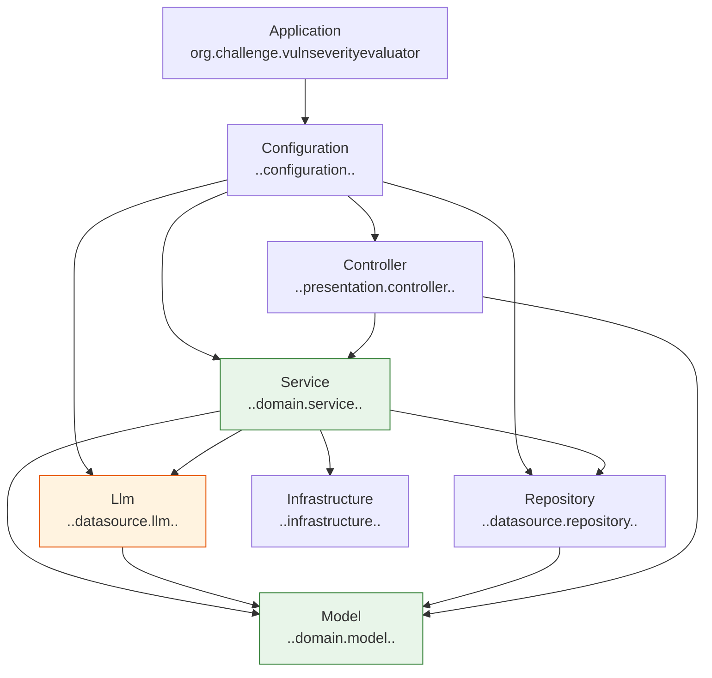

# Arquitectura

Cómo está esquematizada la aplicación y qué restricciones de mantenibilidad mantienen la estructura honesta. El
diseño de la **solución** —por qué existe, qué la restringe, qué riesgos tiene— está en el [ADD](/add/).

---

## Capas

El estilo es Presentation Domain Data Layering; el detalle y el porqué, en el
[Modelo de capas](/architecture/layering-model). Lo propio de este servicio es que **hay dos familias de datasource**,
y el guardrail las trata como capas distintas.



| Capa | Paquete | Puede ser accedida por |
|-------|---------|---------------------|
| Application | `org.challenge.vulnseverityevaluator` | — |
| Configuration | `..configuration..` | **nadie** |
| Controller | `..presentation.controller..` | Configuration |
| Service | `..domain.service..` | Configuration, Controller |
| **Llm** | `..datasource.llm..` | Configuration, Service |
| Repository | `..datasource.repository..` | Configuration, Service |
| Model | `..domain.model..` | Application, Configuration, Controller, Llm, Repository, Service |
| Infrastructure | `..infrastructure..` | Application, Configuration, Controller, Llm, Repository, Service |

**Por qué `Llm` es una capa y no un paquete más.** `datasource/repository` es información de la que la aplicación es
fuente directa; `datasource/llm` es una opinión de un modelo. Son dos cosas con confiabilidad distinta, y darle capa
propia hace que la distinción sea estructural y verificada en cada build, no una convención de nombres.

**Model e Infrastructure no se conocen.** La dirección `Model → Infrastructure` está prohibida, y la inversa también.
Durante la implementación hubo dos concesiones intermedias en ambos sentidos, y ambas desaparecieron al señalizar los
fallos con `Assert` y tipos del JDK en vez de excepciones propias: sin clases de excepción compartidas, no queda
dependencia cruzada que justificar.

---

## Qué vive en cada capa

- **`domain/model`** — solo datos: la entidad, sus embeddables, los value objects y los enums. Nada que calcule. La
  única excepción es la validación de `ModelSeverityProposal`, porque ese value object *es* la traducción de la
  respuesta de un origen de datos.
- **`domain/service`** — el comportamiento: `SeverityScheme` y `Cvss31`, `EvaluationPolicy` (confianza y revisión),
  `SpecificationCatalog` (especificación y vocabulario), y el caso de uso. Los dos primeros son `@Service`; los que
  presentation no consume directamente son `@Component`.
- **`datasource/llm`** — el modelo: interfaz, implementación Spring AI e implementación determinista.
- **`datasource/repository`** — evaluaciones y los dos catálogos.
- **`presentation/controller`** — un controller, un request y un response, que **reutilizan los tipos de dominio** en
  vez de espejarlos.
- **`infrastructure`** — manejo global de errores y métricas.
- **`configuration`** — una clase por concern; los services se auto-registran con `@Service`.

`Cvss31` recibe la especificación como argumento y no consulta ningún repositorio: es una función pura de sus
entradas.

### Residencia de anotaciones

`@Configuration` → `..configuration..`; `@Controller` → `..presentation.controller..`; `@Service` →
`..domain.service..`; `@Entity` → `..domain.model..`; `@Repository` → `..datasource.repository..`.

Las tres de Spring se verifican con `areMetaAnnotatedWith`, no con `areAnnotatedWith`: la versión anterior **no
detectaba `@RestController`**, que es meta-anotación de `@Controller`. `@Configuration` se verifica directa a
propósito, porque `@SpringBootApplication` la lleva como meta-anotación y exigiría mover el composition root.

---

## Endpoint

`POST /vulnerability-evaluations` y `GET /vulnerability-evaluations/{id}`. Contrato completo, criterios de la firma y
modelo de errores en [Endpoints](/architecture/endpoints).

---

## Restricciones de mantenibilidad

Enforced por tests: una violación falla `./gradlew test`.

### `ArchitectureTest`

Capas (matriz de arriba), residencia de anotaciones, y naming de tests con el patrón
`given<Setup>When<Action>Then(DoNotThrow|Return|Set|Throw)<Outcome>`.

> El regex original era `Then[DoNotThrow|Return|Set|Throw]` — una *character class*, no una alternación, que aceptaba
> cualquier carácter de ese conjunto. Corregido a una alternación real.

### `MethodComplexityTest`

Cinco métricas, **tolerancia cero**: ningún método puede exceder ninguna.

| Métrica | Umbral | Métodos que pueden excederlo |
|---|---|---|
| `cyclomatic_complexity` | 5 | **0** |
| `nesting_depth` | 3 | **0** |
| `number_of_parameters` | 5 | **0** |
| `logical_lines_of_code` | 32 | **0** |
| `physical_lines_of_code` | 64 | **0** |

El test además **falla si algún archivo no se puede parsear**. No es paranoia: con el nivel de lenguaje por defecto,
JavaParser rechazaba los records y 12 de 45 archivos no se analizaban, así que el gate pasaba en verde midiendo casi
nada. Un guardrail tiene que fallar cuando no puede hacer su trabajo, no solo cuando encuentra una violación.

El presupuesto condicionó el diseño, y la respuesta correcta fue código genuinamente simple —pesos como dato en vez
de `switch`, objetos cohesivos en vez de parámetros sueltos, utilidades de Spring en vez de métodos privados de
guarda— y no partir métodos para esconder ramas.

### Verificación

```bash
./gradlew test
```

Al agregar o cambiar una regla de capas se hace el **chequeo negativo**: introducir la dependencia prohibida,
confirmar que el build falla, revertir.

---

## Stack

| Componente | Tecnología | Versión |
|-----------|-----------|---------|
| Framework | Spring Boot | 4.1.1 |
| IA | Spring AI (`spring-ai-starter-model-openai`) | 2.0.1 |
| Web | `spring-boot-starter-webmvc` | gestionado |
| Persistencia | `spring-boot-starter-data-jpa` + H2 | gestionado |
| Validación | `spring-boot-starter-validation` | gestionado |
| Arquitectura | ArchUnit | 1.5.0 |
| Complejidad | JavaParser | 3.27.0 |
| Tests | JUnit | 6.0.0 |

---

## Enlaces

- [ADD](/add/) — el diseño de la solución
- [Modelo de capas](/architecture/layering-model) — cómo funciona el sistema de capas y por qué
- [Endpoints](/architecture/endpoints) · [Modelo de datos](/architecture/data-model)
- [Uso de IA y sus límites](/architecture/ai-usage-and-limits)
- [ADRs](/adr/) — las decisiones y sus alternativas descartadas
