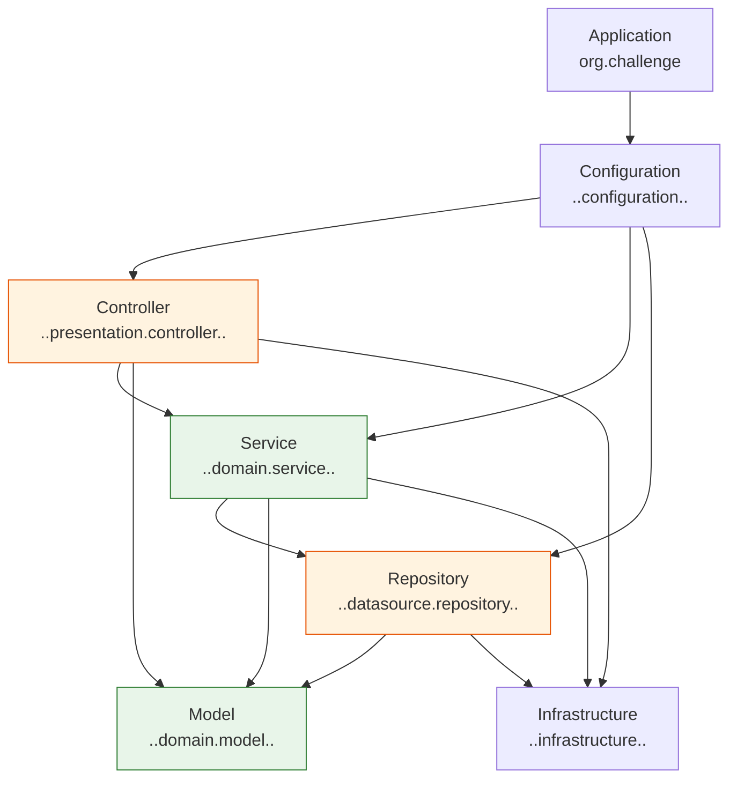

# Architecture

Reference document for the internal architecture of **vuln-severity-evaluator**:
how the application is schematised into layers and the code-maintainability
constraints that keep the structure honest. See
[Documentation sources](#documentation-sources) at the bottom for how each
section was produced and how to refresh it.

> This service is **greenfield**: the layer rules and complexity budget below
> are already enforced by fitness tests, but no controller, service, model, or
> repository classes exist yet. Everything here describes the contract new
> code must satisfy, not a description of an existing large system.

---

## How the application is schematised

There is a single module (no parallel `src/main` / `src/test` package split
for production code itself — tests live under `src/test/java`, mirroring
`src/main/java`):

```
src/
├── main/
│   ├── java/org/challenge/                     ← Application layer (root package)
│   └── resources/
│       └── application.yaml                    ← Spring configuration (spring.ai.openai.api-key, ...)
└── test/
    └── java/org/challenge/vulnseverityevaluator/
        ├── ArchitectureTest.java                ← ArchUnit layering + annotation-residency + test-naming fitness tests
        └── MethodComplexityTest.java             ← JavaParser cyclomatic-complexity fitness test
```

`src/main/java/org/challenge/vulnseverityevaluator/Main.java` currently exists
only as an IntelliJ-generated scratch template (implicit `main()`,
`IO.println`, `//TIP` comments) — it is **not** a Spring Boot entry point
(no `@SpringBootApplication`, no `public static void main(String[] args)`)
and is not wired into any of the layers below. It should be treated as
throwaway, not as the application's composition root.

### Layer responsibilities and dependency direction

The layers are defined and enforced by
`ArchitectureTest.givenLayeredArchitectureWhenCheckThenDoNotThrowException`
using ArchUnit's `layeredArchitecture()`:



| Layer | Package | May be accessed by |
|-------|---------|---------------------|
| Application | `org.challenge` (root) | — |
| Configuration | `..configuration..` | **nobody** (`mayNotBeAccessedByAnyLayer`) |
| Controller | `..presentation.controller..` | Configuration |
| Service | `..domain.service..` | Configuration, Controller |
| Repository | `..datasource.repository..` | Configuration, Service |
| Model | `..domain.model..` | Application, Configuration, Controller, Repository, Service |
| Infrastructure | `..infrastructure..` | Application, Configuration, Controller, Repository, Service |

Read the table as "this layer's classes may only be imported by the layers
listed" — i.e. the access direction, not what the layer itself may import.
`Configuration` is the wiring root: it is never imported by application code,
which keeps bean assembly out of the business layers.

### Annotation residency

`ArchitectureTest` also pins Spring/JPA stereotypes to their layer package,
independently of the dependency-direction rule above:

| Annotation | Must reside in |
|------------|-----------------|
| `@org.springframework.context.annotation.Configuration` | `..configuration..` |
| `@org.springframework.stereotype.Controller` | `..presentation.controller..` |
| `@org.springframework.stereotype.Service` | `..domain.service..` |
| `@jakarta.persistence.Entity` | `..domain.model..` |
| `@org.springframework.stereotype.Repository` | `..datasource.repository..` |

A class annotated `@Service` outside `domain.service` (or an `@Entity`
outside `domain.model`, etc.) fails the build even if the layered-dependency
rule above would otherwise allow it.

---

## Endpoint surface

No controllers exist yet. Once the first endpoint is added, document its
method, path, handler, and description here (and add a dedicated
`architecture/endpoints.md` page with request/response contracts and the
error model, mirroring `data-model.md` once entities exist) — see the
[sync checklist](/_meta/how-to-use).

---

## Code-maintainability constraints

These constraints are **enforced by tests** under
`src/test/java/org/challenge/vulnseverityevaluator/`, so a violation fails
`./gradlew test` — they are executable, not just documentation.

### 1. Layer boundaries — `ArchitectureTest`

`givenLayeredArchitectureWhenCheckThenDoNotThrowException` — ArchUnit
`layeredArchitecture()` check over the access matrix above (`allowEmptyShould(true)`,
so it passes while layers are still empty).

### 2. Annotation residency — `ArchitectureTest`

Five tests (`given<Annotation>AnnotatedResideIn<Layer>PackageWhenCheckThenDoNotThrowException`),
one per stereotype in the table above.

### 3. Test naming — `ArchitectureTest`

`givenNamingConventionForTestMethodsWhenCheckThenDoNotThrowException` requires
every `@Test` method to match:

```
given.+When.+Then[DoNotThrow|Return|Set|Throw].+
```

i.e. `given<Setup>When<Action>Then<DoNotThrow|Return|Set|Throw><Outcome>`.

### 4. Method complexity budget — `MethodComplexityTest`

`givenMethodsComplexityWhenCheckThenDoNotThrowException` parses every `.java`
file under `src/main` with JavaParser and computes a simple cyclomatic
complexity per method (1 + count of `if`, `else`, `for`, `while`, `do`,
`case`, `default:`, `catch`, `&&`, `||`, after stripping comments). The build
fails only once **more than 5 methods** in the whole codebase exceed a
complexity of **10** — a budget of offenders, not a hard per-method cap.

| Metric | Value |
|--------|-------|
| Cyclomatic complexity threshold | 10 |
| Max methods allowed above threshold | 5 |

### Build & verification commands

```bash
./gradlew build
./gradlew test        # architecture + complexity + unit tests
```

---

## Version stack

| Component | Technology | Version |
|-----------|-----------|---------|
| Framework | Spring Boot | 4.1.1 |
| AI | Spring AI (`spring-ai-starter-model-openai`) | 2.0.1 (BOM) |
| Web | `spring-boot-starter-webmvc` | managed by Spring Boot |
| Persistence | `spring-boot-starter-data-jpa` | managed by Spring Boot |
| Architecture fitness tests | ArchUnit | 1.5.0 |
| Complexity fitness tests | JavaParser | 3.23.1 |
| Tests | JUnit | 6.0.0 |

See [build.gradle](../../../build.gradle) for the authoritative dependency list.

---

## Links

- [Layering model](/architecture/layering-model) — how the layer system works and why
- [Domain](/domain/) — business context this architecture serves
- [ADRs](/adr/) — architectural decisions taken
- [Docsify guide home](/)

---

## Documentation sources

| Section | Source | How to refresh |
|---------|--------|---------------|
| Layer packages + access matrix | `src/test/java/org/challenge/vulnseverityevaluator/ArchitectureTest.java` (`*_ACCESS` constants + `layeredArchitecture()`) | Re-read the constants and the `whereLayer(...)` chain if a rule changes |
| Annotation residency | `ArchitectureTest.java` `annotatedClassesShouldResideIn` calls | Re-read the five `given<Annotation>...` tests |
| Test naming convention | `ArchitectureTest.givenNamingConventionForTestMethodsWhenCheckThenDoNotThrowException` | Re-read the regex in that test |
| Complexity budget | `src/test/java/org/challenge/vulnseverityevaluator/MethodComplexityTest.java` (`METHOD_COMPLEXITY_THRESHOLD`, `METHOD_COUNT_THRESHOLD`) | Re-read the constants in that test |
| Version stack | `build.gradle` | Re-read the `dependencies` / `dependencyManagement` blocks |
